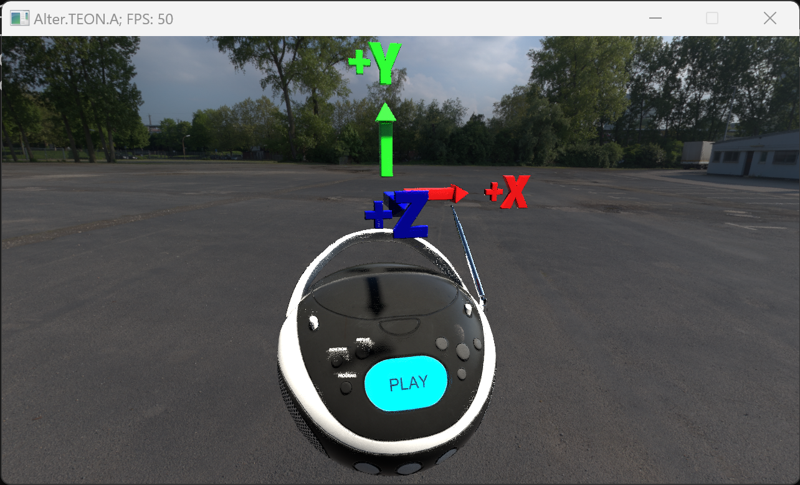
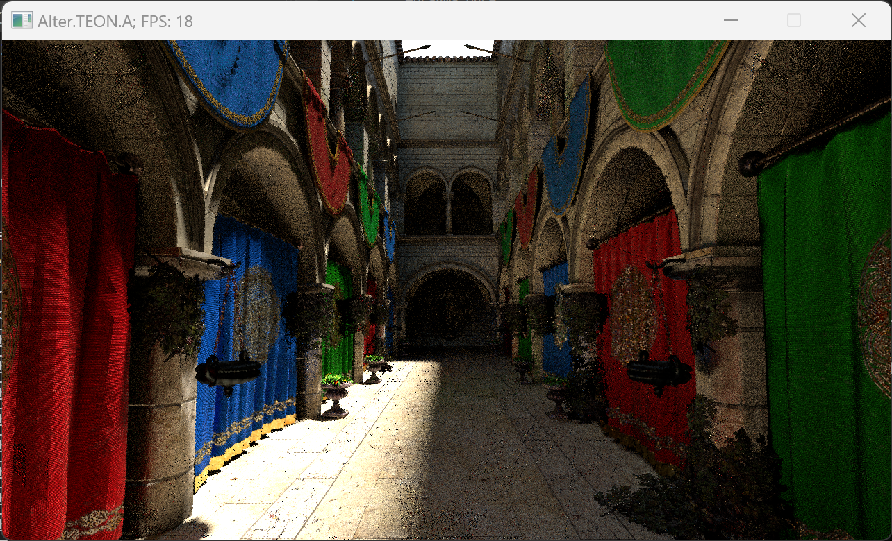

# 🌋 Alter 🌋

Some functionality still WIP, but almost ready to ***MVP***…

## Важное примечание…

  - 👑 [GitHub, документация](https://github.com/helixd2s/about)
  - 🥀 [GitHub, идеология](https://github.com/helixd2s/core) (резерв)
  - 🥀 [VK паблик](https://vk.com/helixd2s)
  - 🥀 [Наш сайт](http://about.helixd2s.su/) (там просто редирект пока что)

## Screenshots

  

## Renderer features

  - [x] ♟️ Almost full Vulkan API 1.3
  - [x] ♟️ Minimal and extensible interface (Open Source, SDK)
  - [x] ♟️ Native ray tracing support (HW/RT cores, ray-query)
  - [x] ♟️ Some automatizations (incl. barriers, etc.)
  - [x] ♟️ Multi-draw of geometries or meshes
  - [x] ♟️ Graphics and compute shaders support
  - [x] ♟️ Async-model support, with sort of GC (alike JS)
  - [x] ♟️ Input lockless and independent rendering
  - [x] ♟️ Using same pipelines for rendering
  - [x] ♟️ Almost fully bindless model
  - [x] ♟️ Resource independent uploader (with full VMA support, and sparse memory)
  - [x] 🚧 Partial basic multi-threading support
  - [x] 🚧 Multi-draw with instances (TLAS, NOT TESTED)
  - [x] 🚧 Better instancing support (reusing, indexing, NOT TESTED)
  - [ ] 🧩 Secondary or alternative pipelines
  - [ ] 🧩 Ray-tracing pipelines (currently used ray-query)
  - [ ] 🧩 More extensions support (such as ray-tracing maintenance)
  - [ ] 🧩️ OpenGL support (interop)
  - [ ] 🧩 Interface wrapper and SDK (for C/C++)
  - [ ] 👑 Full and native ReShade support
  - [ ] 👑 Interop with CUDA and OpenCL (**not** AMD)
  - [ ] 👑 Interop with DirectX 12
  - [ ] 👑 DirectX 12 underlayer of Vulkan
  - [ ] 👑️ Implementation for some games

## Built-in shaders SDK features

  - [x] ♟️ Test shaders (currently, not a library)
  - [x] ♟️ Reprojection of reflections and transparency
  - [x] ♟️ Checkerboard optimization (for diffuse/reflection)
  - [x] ♟️ Temporal screen-space reprojection (accumulation)
  - [x] 🚧 Pre-defined shader packages
  - [ ] 🧩 Rewrite to HLSL (needs features)
  - [ ] 🧩 Distances, MIP and LoD support
  - [ ] 🧩 Short-range SSRT support

## Complex engine technology

  - [x] ♟️ Software rasterization misc (barycentrics, vector-sampling)
  - [x] ♟️ Dynamic vertex pulling and rendering
  - [x] ♟️ Basic two-level rendering model
  - [ ] 🧩 Different resolution buffers and anti-aliasing support (**important**)
  - [ ] 🧩 More temporal technology and techniques (such as TAA, FSR 2.0, DLSS, **important**)
  - [ ] 🧩 Advanced shadow maps (with simpler RT, **important**)
  - [ ] 🧩 Full subgroups support (incl. variable)
  - [ ] 🧩 Full vulkan memory model support
  - [ ] 👑️ Console support
  - [ ] 👑️ Graphic interface
  - [ ] 👑️ More interactivity
  - [ ] 👑️ Edit materials

## Integrations

  - [x] ☄️ Basic GLTF support (single model, PBR)
  - [ ] ☄️ KTX-2 format support
  - [ ] 👑 Radix sort for all GPU (GLSL and HLSL)

## Testing and demo initialive 

  - [x] ☄️ Env. map testing
  - [x] ☄️ Argument passing for app
  - [x] ☄️ Basic controller (camera moving)
  - [ ] ☄️ Basic OBJ support
  - [ ] ☄️ Physics demo (interactive, dynamic)
  - [ ] ☄️ Advanced GLTF support (more than one model, more features)
  - [ ] ☄️ GLTF animations support
  - [ ] ☄️ GUI controllers and better interactivity
  - [ ] ☄️ Motion-vectors and animations
  
## Minecraft and Java 16 spec-operation (project `TNT` or `ANT`)…

  - [ ] ☕ Latest LWJGL loading, interop and support
  - [ ] ☕ JNI, JavaCPP and Java support (lossless)
  - [ ] ☕ Correct Kotlin support (subset of Java)
  - [ ] ☕ OpenGL interop and compatibility
  - [ ] ☕ Interop with VMA (almost done)
  - [ ] ☕ Minecraft mod itself (Forge)
  - [ ] ☕ Support for Fabric (mod, library, api)
  - [ ] ☕ Support for 1.18.2 and/or beyond
  - [ ] 👑 Support for Rendering API and Blaze3D
  - [ ] 👑 Support for OptiFabric (Fabric)
  - [ ] 👑 Support for Immersive Portals Mod (Fabric)
  - [ ] 👑 Support for Forge (mod, library)
  - [ ] 👑 Support for Optifine (Forge)

## Dependencies

  - 📀 [VK-utils](https://github.com/helixd2s/vk-utils) 
  - 📀 [Vcpkg](https://github.com/microsoft/vcpkg) (with `GLFW3`)
  - 📀 [Vulkan SDK](https://vulkan.lunarg.com/)
  - 📀 [NVIDIA Vulkan Beta Driver](https://developer.nvidia.com/vulkan-driver)

  But mostly already has with submodules.

## If you have issues…

### ASAN AddressSanitizer issues…

  From NVIDIA…

  ```
   Because this is an AddressSanitizer error, can you confirm the crash does not repro when run without ASAN? By default ASAN does not intercept GlobalAlloc, which leads to false positives. Because our driver uses GlobalAlloc and GlobalFree you need to set this in the environment:

  ASAN_OPTIONS=windows_hook_legacy_allocators=true

  You can read more about this runtime option here: https://docs.microsoft.com/en-us/cpp/sanitizers/asan-runtime?view=msvc-170#msvc-specific-addresssanitizer-runtime-options
  ```

### Compile instruction?

  0. Please, enable symbolic links support in your (GIT) system
  1. Do `git clone https://github.com/helixd2s/Alter.git --recursive` with submodules
  2. Install `vcpkg` into disk `C:/vcpkg`.
  3. Make sure that you installed **not** as `C:/vcpkg/vcpkg` or etc.
  4. Do `vcpkg install glfw3` in command-line, install other deps.
  5. Install latest version of Vulkan SDK (`1.3.211.0`)
  6. Configure project with CMake, into `<Alter>/build` local directory
  7. Compile SPIR-V modules in `<Alter>/project/test`...
  8. Copy or sym-link containement of `<Alter>/project/prebuild` into `<Alter>/build`
  9. Open `*.sln`, and compile project through `Visual Studio 2022`
  10. Run with `-m <SomeModel>.gltf -s 1.0` flags (where `-m` is modelname, `-s` is scale)
